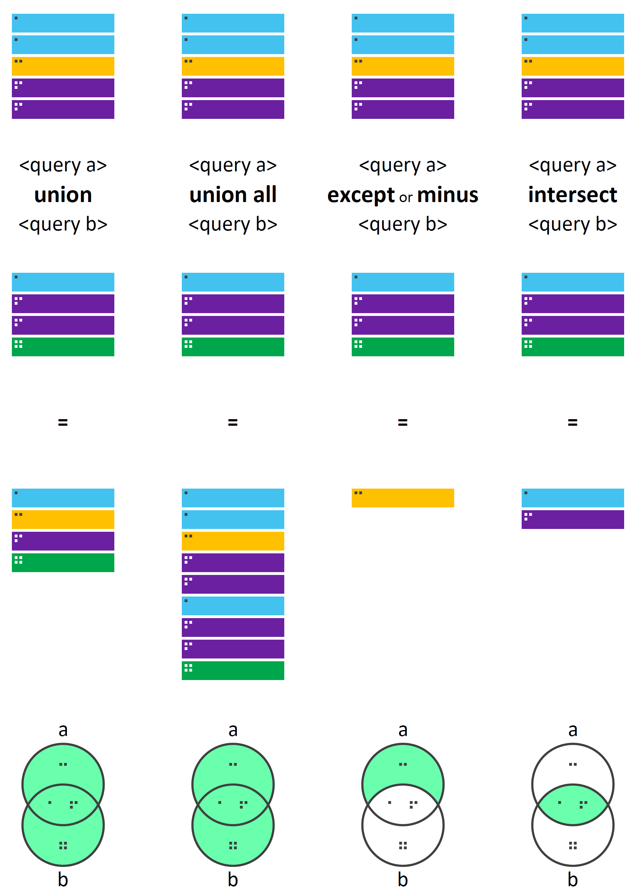

```{r setup, include=F}
library(learnr)
library(DiagrammeR)
library(RSQLite)
library(DBI)

tutorial_options(exercise.cap = "Query", exercise.eval = F)

## Get data files
orders <- read.delim('https://github.com/nchelaru/SQL-learnr/raw/4180e548ac774a96ebbdba17d89853a635eae4a0/orders.txt')

orderlines <- read.delim('https://github.com/nchelaru/SQL-learnr/raw/4180e548ac774a96ebbdba17d89853a635eae4a0/orderlines.txt')

products <- read.delim('https://github.com/nchelaru/SQL-learnr/raw/4180e548ac774a96ebbdba17d89853a635eae4a0/products.txt')

customers <- read.delim('https://github.com/nchelaru/SQL-learnr/raw/4180e548ac774a96ebbdba17d89853a635eae4a0/customers.txt')

campaigns <- read.delim('https://github.com/nchelaru/SQL-learnr/raw/4180e548ac774a96ebbdba17d89853a635eae4a0/campaigns.txt')

## Rename column headers
colnames(products) <- c('productid', 'productname', 'productgroupcode', 'productgroupname', 'instockflag', 'fullprice')

## Create an ephemeral in-memory RSQLite database
con <- dbConnect(SQLite(), ":memory:")

## Create table for each data file
dbWriteTable(con, "orders", orders, overwrite=T)

dbWriteTable(con, "orderlines", orderlines, overwrite=T)

dbWriteTable(con, "products", products, overwrite=T)

dbWriteTable(con, "customers", customers, overwrite=T)

dbWriteTable(con, "campaigns", campaigns, overwrite=T)
```

## Introduction

<br>
 
<div style='font-size:16px; margin:15px;'>

Welcome to the interactive SQL tutorial brought to you by Intelligence Refinery!

<br>

Here, you can learn and, most importantly, **experiment** with queries that cover a wide range of interactions with SQL databases, from accessing data to updating tables. Throughout these exercises, we will use example data files used in *Data Analysis Using SQL and Excel* by Gordon Linoff. You can find there [here](https://www.wiley.com/en-ca/Data+Analysis+Using+SQL+and+Excel%2C+2nd+Edition-p-9781119021438) for download.

<br>

This is an overview of the tables that we will be using:

```{r, echo=F, out.width='100%', fig.align='center'}
library(datamodelr)

dm_f <- dm_from_data_frames(orders, orderlines, products, customers, campaigns)

graph <- dm_create_graph(dm_f, rankdir = "BT", col_attr = c("column", "type"))

dm_render_graph(graph)
```

On each page, feel free to not only run the example code already provided, but also try them out with different columns and tables to get a better idea as to how they work.

</div>

<br>

## Select records {data-progressive=TRUE}

<br>

<div style='font-size:16px; margin:15px;'>
We will start with the SELECT statement, which is used to retrieve records, as a data table, from a database.

<br>

As you work through each exercise, click on the **"Continue"** button to reveal more content.
</div>

<br>

### 1. Select all columns

```{r select-all, exercise=TRUE, exercise.diagnostics=F}
query <- "SELECT * 
          FROM orderlines
          LIMIT 10"

dbGetQuery(con, query)
```

<br>

### 2. Select some columns

```{r select-some, exercise=TRUE, exercise.diagnostics=F}
query <- "SELECT orderid, productid, billdate, totalprice
          FROM orderlines
          LIMIT 10"

dbGetQuery(con, query)
```

<br>

### 3. Select distinct values from a given column

```{r distinct-select, exercise=TRUE, exercise.diagnostics=F}
query <- "SELECT DISTINCT paymenttype
          FROM orders"

dbGetQuery(con, query)
```

<br>

### 4. Select NULL values from a given column

<div style='font-size:16px; margin:15px;'>
It is possible for a field to contain **no value**. To select records that contain NULL value in any of the columns: 

```{r select-null, exercise=TRUE, exercise.diagnostics=F}
query <- "SELECT * 
          FROM orders
          WHERE city IS NULL"

dbGetQuery(con, query)
```


<br> 

Note, a NULL value is **not** the same as a *blank* value, as:

```{r select-empty, exercise=TRUE, exercise.diagnostics=F}
query <- "SELECT * 
          FROM orders
          WHERE city = ''"

dbGetQuery(con, query)
```

</div>

<br>

### 5. Sort query results  

<div style='font-size:16px; margin:15px;'>
By default, `ORDER BY` is done in **ascending** order:
```{r sort-select-asc, exercise=TRUE, exercise.diagnostics=F}
query <- "SELECT DISTINCT city 
          FROM orders
          ORDER BY city"

dbGetQuery(con, query)
```

<br>

To sort in **descending** order:

```{r sort-select-desc, exercise=TRUE, exercise.diagnostics=F}
query <- "SELECT DISTINCT state 
          FROM orders
          ORDER BY state DESC"

dbGetQuery(con, query)
```

</div>
<br>


### 6. Assign new column names to selected columns

<div style='font-size:16px; margin:15px;'>
To help make the data more readable:

```{r alias-select, exercise=TRUE, exercise.diagnostics=F}
query <- "SELECT productid AS ID, 
                 productname AS Name,
                 productgroupcode AS GroupCode,
                 productgroupname AS GroupName,
                 instockflag AS Status,
                 fullprice AS Price
          FROM products
          LIMIT 10"

dbGetQuery(con, query)
```


</div>


## Filter records {data-progressive=TRUE}

<br>

<div style='font-size:16px; margin:15px;'>
The `WHERE` and `LIKE` statements are used to get only those records that fit one or more specified criteria.

<br>

As you work through each exercise, click on the **"Continue"** button to reveal more content.
</div>

<br>

### 1. Filter by a single condition

#### 1.1 Text values

<div style='font-size:16px; margin:15px;'>
The string to be matched needs to be encased in single or double quotation marks:

```{r filter-char, exercise=TRUE, exercise.diagnostics=F}
query <- "SELECT * 
          FROM campaigns
          WHERE channel='AD'"

dbGetQuery(con, query)
```

</div>
<br>

#### 1.2 Numerical values

<div style='font-size:16px; margin:15px;'>
No quotation marks are needed for numers:

```{r filter-num, exercise=TRUE, exercise.diagnostics=F}
query <- "SELECT * 
          FROM orders 
          WHERE customerid=174257"

dbGetQuery(con, query)
```

Or

```{r filter-less, exercise=TRUE, exercise.diagnostics=F}
query <- "SELECT * 
          FROM orders 
          WHERE totalprice < 90"

dbGetQuery(con, query)
```

</div>
<br>

#### 1.3 Inverse selection

<div style='font-size:16px; margin:15px;'>
You can also specify what you do **not** want:

```{r filter-not, exercise=TRUE, exercise.diagnostics=F}
query <- "SELECT * 
          FROM campaigns
          WHERE NOT channel='insert'"

dbGetQuery(con, query)
```

</div>
<br>

#### 1.4 `BETWEEN`

<div style='font-size:16px; margin:15px;'>
To get records that somehow fit within a given range of values.

<br>

1.4.1 Range of numeric values

```{r between-numeric, exercise=TRUE, exercise.diagnostics=F}
query <- "SELECT orderid, orderdate, city, state, paymenttype, totalprice
          FROM orders
          WHERE totalprice BETWEEN 20 AND 30"

dbGetQuery(con, query)
```

<br>

1.4.2 Range of text values

```{r between-text, exercise=TRUE, exercise.diagnostics=F}
query <- "SELECT DISTINCT firstname
          FROM customers
          WHERE firstname BETWEEN 'KATHY' AND 'LAWRENCE'
          ORDER BY firstname"

dbGetQuery(con, query)
```

<br>

1.4.3 Range of dates

```{r between-date, exercise=TRUE, exercise.diagnostics=F}
query <- "SELECT *
          FROM orderlines
          WHERE billdate BETWEEN '2009-12-01' AND '2010-12-01'
          ORDER BY billdate"

dbGetQuery(con, query)
```

</div>
<br>

#### 1.5 Match by wildcards

<div style='font-size:16px; margin:15px;'>
Finally, use the `LIKE` statement with a wildcard character to query records that fit a fuzzy pattern:

- `%` : None, one or multiple characters
- `_` : A single character

<br> 

Get all customers who have a firstname starting with 'C':

```{r like-multiple, exercise=TRUE, exercise.diagnostics=F}
query <- "SELECT * 
          FROM customers
          WHERE firstname LIKE 'C%'"

dbGetQuery(con, query)
```

<br> 

Get all campaigns whose ID git the pattern '205*':

```{r like-single, exercise=TRUE, exercise.diagnostics=F}
query <- "SELECT * 
          FROM campaigns
          WHERE campaignid LIKE '205_'"

dbGetQuery(con, query)
```

</div>
<br>

### 2. Filter by multiple conditions

<div style='font-size:16px; margin:15px;'>
Multiple filtering conditions can be specified using the operators `AND`, `OR`, and `IN`:

<br>

#### 2.1 `AND`

To get records that fulfill **all** of the conditions specified:

```{r filter-and, exercise=TRUE, exercise.diagnostics=F}
query <- "SELECT * 
          FROM products
          WHERE productgroupname='CALENDAR' AND fullprice > 20"

dbGetQuery(con, query)
```

<br>

#### 2.2 `OR`

To get records that fulfill **at least one** of the conditions specified:

```{r filter-or, exercise=TRUE, exercise.diagnostics=F}
query <- "SELECT * 
          FROM orders
          WHERE paymenttype='MC' OR paymenttype='VI'"

dbGetQuery(con, query)
```

<br>

#### 2.3 `IN`

A shorthand for multiple `OR` conditions:

```{r filter-in, exercise=TRUE, exercise.diagnostics=F}
query <- "SELECT * 
          FROM orders
          WHERE state IN ('MA', 'NY', 'FL')"

dbGetQuery(con, query)
```

<br>

#### 2.4 Combine `AND` & `OR` operators

To clearly separate which set of conditions are "either-or" and which are "must", parentheses are needed:

```{r filter-combine, exercise=TRUE, exercise.diagnostics=F}
query <- "SELECT * 
          FROM orders
          WHERE state='MA' AND (city='NEWTON' OR city='CAMBRIDGE')"

dbGetQuery(con, query)
```

</div>


## Aggregate records {data-progressive=TRUE}

<br>

<div style='font-size:16px; margin:15px;'>
It is often useful to calculate summary statistics of records in the database, whether it be column-wise or with respect to values in another column.

<br>

As you work through each exercise, click on the **"Continue"** button to reveal more content.

</div>
<br>

### 1. Count

```{r count, exercise=TRUE, exercise.diagnostics=F}
query <- "SELECT COUNT(DISTINCT state) 
          FROM orders"

dbGetQuery(con, query)
```

<br>

### 2. Group by

<div style='font-size:16px; margin:15px;'>

To get summary statistics that are aggregated by values in another column:

```{r group-by, exercise=TRUE, exercise.diagnostics=F}
query <- "SELECT gender, COUNT(DISTINCT customerid) 
          FROM customers
          GROUP BY gender"

dbGetQuery(con, query)
```

</div>

<br>

### 3. HAVING

<div style='font-size:16px; margin:15px;'>
The `WHERE` statement cannot be used to filter aggregated records. Instead, the `HAVING` statement should be used:

```{r group-having, exercise=TRUE, exercise.diagnostics=F}
query <- "SELECT productgroupname, COUNT(DISTINCT productid) 
          FROM products
          GROUP BY productgroupname
          HAVING instockflag='Y'"
      
dbGetQuery(con, query)
```

</div>

<br>


### 4. Column minimum/maximum

<div style='font-size:16px; margin:15px;'>

```{r min, exercise=TRUE, exercise.diagnostics=F}
query <- "SELECT MIN(fullprice)
          FROM  products"

dbGetQuery(con, query)
```

```{r max, exercise=TRUE, exercise.diagnostics=F}
query <- "SELECT MAX(discount) 
          FROM campaigns"

dbGetQuery(con, query)
```

</div>

<br>

### 5. Column average
<div style='font-size:16px; margin:15px;'>

```{r average, exercise=TRUE, exercise.diagnostics=F}
query <- "SELECT AVG(fullprice)
          FROM products"

dbGetQuery(con, query)
```

</div>
<br>

### 6. Column sum

<div style='font-size:16px; margin:15px;'>
```{r sum, exercise=TRUE, exercise.diagnostics=F}
query <- "SELECT SUM(discount)
          FROM campaigns"

dbGetQuery(con, query)
```

</div>
<br>

## Create/Update data {data-progressive=TRUE}

<br>

<div style='font-size:16px; margin:15px;'>

As you work through each exercise, click on the **"Continue"** button to reveal more content.

</div>

<br>

### 1. Create new records

<div style='font-size:16px; margin:15px;'>

Insert a new record that has values for all columns:

```{r insert-all, warning=FALSE, exercise=TRUE, exercise.diagnostics=F}
query <- "INSERT INTO customers
          VALUES (0,  '49338261', 'M', 'JIM')"

dbSendStatement(con, query)
```

<br>

Let's look at the newly inserted record:

```{r insert-all-check, warning=F,  exercise=TRUE, exercise.diagnostics=F}
query <- "SELECT  * 
          FROM customers
          ORDER BY customerid
          LIMIT 5"

dbGetQuery(con, query)
```

<hr>
 
You can also insert a record that contains values for only *some* of the columns:

```{r insert-some, warning=F,  exercise=TRUE, exercise.diagnostics=F}
query <- "INSERT INTO campaigns (campaignid, channel)
          VALUES (4000, 'INSERT')"

dbSendStatement(con, query)
```

<br>

Again, check the new record:

```{r insert-some-check, warning=F,  exercise=TRUE, exercise.diagnostics=F}
query <- "SELECT * 
          FROM campaigns
          WHERE campaignid = 4000"

dbGetQuery(con, query)
```

</div>

<br>

### 2. Conditionally update record(s)

<div style='font-size:16px; margin:15px;'>
To update a single record, the `WHERE` statement needs to specify a uniquely identifying field for the record:

```{r update-single, warning=F,  exercise=TRUE, exercise.diagnostics=F}
query <- "UPDATE orderlines
          SET unitprice = 100.00, numunits = 5, totalprice = 500.00
          WHERE orderlineid = '1010580' AND orderid = '1009196' AND productid = '10842'"

dbSendStatement(con, query)
```

<br>

Or, update all records that fit a given condition:

```{r update-multiple, warning=F,  exercise=TRUE, exercise.diagnostics=F}
query <- "UPDATE orderlines
          SET unitprice = 24.00
          WHERE productid = '10001'"

dbSendStatement(con, query)
```

</div>

<br>

### 3. Arithmetic operations 

<div style='font-size:16px; margin:15px;'>

Columns can be added, subtracted, multiplied, divided just like numbers:

```{r arithmetic1, warning=F,  exercise=TRUE, exercise.diagnostics=F}
query <- "SELECT orderlineid, unitprice, numunits, totalprice,
                 unitprice * numunits AS calc_totalprice
          FROM orderlines"

dbGetQuery(con, query)
```

<br>

Arithmetic operations can also be done within the `WHERE` statement:

```{r arithmetic2, warning=F,  exercise=TRUE, exercise.diagnostics=F}
query <- "SELECT orderlineid, unitprice, numunits, totalprice
          FROM orderlines
          WHERE (unitprice * numunits) < totalprice"

dbGetQuery(con, query)
```

</div>

<br>

### 4. Create new column conditional upon values in another column

<div style='font-size:16px; margin:15px;'>

The `CASE`... `WHEN`... statement allows a new "indicator" column to be created depending on the value of another column.

<br>

Let's first look at the `payementtype` column in the `orders` table, which contains names of various types of credit/debit cards in shorthand names.
```{r check, warning=F, exercise=TRUE, exercise.diagnostics=F}
query <- "SELECT orderid, paymenttype
          FROM orders
          LIMIT 10"

dbGetQuery(con, query)
```

<br>

To help make the data more readable, these "subgroups" can be clustered into more general groups:

```{r case-when, warning=F, exercise=TRUE, exercise.diagnostics=F}
query <- "SELECT orderid, paymenttype,
          CASE
              WHEN paymenttype IN ('VI', 'MC', 'AE', 'OC') THEN 'Credit card'
              WHEN paymenttype == 'DB' THEN 'Debit card'
              ELSE 'Unknown'
          END AS paymentmethod
          FROM orders"

dbGetQuery(con, query)
```


```{r, eval=T, echo=F}
## Recreate the tables from original data
## Create table for each data file
dbWriteTable(con, "orders", orders, overwrite=T)

dbWriteTable(con, "orderlines", orderlines, overwrite=T)

dbWriteTable(con, "products", products, overwrite=T)

dbWriteTable(con, "customers", customers, overwrite=T)

dbWriteTable(con, "campaigns", campaigns, overwrite=T)
```

</div>

<br>


## Join tables {data-progressive=TRUE}

<br>

<div style='font-size:16px; margin:15px;'>
The `JOIN` clause allows rows from multiple tables to be combined on the basis of a column shared amongst them.
  
<br>

Here is a handy schematic illustrating the different types of `JOIN` operations created by the Reddit users `/u/bbalkenhol` and `/u/mecartistronico`.

<br>

{width=90%}

<br>

Before we get started, let's look at which columns are shared by which tables in this database:

```{r, echo=F, eval=T, out.width='100%', fig.align='center'}
library(datamodelr)

dm_f <- dm_from_data_frames(orders, orderlines, products, customers, campaigns)

dm_f <- dm_add_references(
  dm_f,
  orders$campaignid == campaigns$campaignid,
  orders$customerid == customers$customerid,
  orderlines$orderid == orders$orderid,
  orderlines$productid == products$productid
)

graph <- dm_create_graph(dm_f, rankdir = "LR", col_attr = c("column", "type"))

dm_render_graph(graph)
```

</div>
<br>

### 1. `INNER JOIN`

<div style='font-size:16px; margin:15px;'>
We will first give `INNER JOIN` a whirl to compare different compaign channels in terms of the average spending on each order, as this can provide insights into the relative efficacy of each approach for future marketing efforts.

First, join the `campaigns` and `orders` tables by the `campaignid` column that they share, to associate these two types of information:

```{r inner-join, exercise=TRUE, exercise.diagnostics=F, exercise.lines=12}
query <- "SELECT campaigns.campaignid, 
                 campaigns.channel, 
                 campaigns.discount, 
                 campaigns.freeshippingflag,
                 orders.campaignid, 
                 orders.city, 
                 orders.state, 
                 orders.totalprice
          FROM campaigns
          INNER JOIN orders ON campaigns.campaignid = orders.campaignid"

dbGetQuery(con, query)
```

<br>

Then, the average `totalprice` of orders associated with each campaign channel can be calculated via aggregating by `channel`. While this can be all done in the same query as the `INNER JOIN` operation, it would create a large and complex query that could be hard to debug. 

Instead, we can use a *common table expression* (CTE) (the `WITH` clause) to "hold" the joined data structure in an empheremal table that only exists in this query. A table name is assigned to it (`joined_table` in our case), and queries can be made to select data from it like a regular table:

```{r with, exercise=TRUE, exercise.diagnostics=F, exercise.lines=20}
query <- "WITH joined_table AS                      
            (SELECT campaigns.campaignid,
                    campaigns.channel,
                    campaigns.discount,
                    campaigns.freeshippingflag,
                    orders.campaignid,
                    orders.city,
                    orders.state,
                    orders.totalprice
             FROM campaigns
             INNER JOIN orders ON campaigns.campaignid = orders.campaignid)
          SELECT channel, 
                 AVG(totalprice) AS avg_totalprice    
          FROM joined_table
          GROUP BY channel
          ORDER BY avg_totalprice"

dbGetQuery(con, query)
```
 
</div>
<br>


### 2. `LEFT JOIN`

<div style='font-size:16px; margin:15px;'>

```{r left-join, exercise=TRUE, exercise.diagnostics=F, exercise.lines=12}
query <- "SELECT customers.customerid AS customersCustomerid,
                 customers.firstname,
                 orders.customerid AS OrdersCustomerid,
                 orders.orderid
          FROM orders
          LEFT JOIN customers ON orders.customerid = customers.customerid
          ORDER BY customerCustomerid"

dbGetQuery(con, query)
```


</div>

<br>

<!-- ## Union  {data-progressive=TRUE} -->

<!-- The `UNION` operator combines result-sets that have the same columns in the same order. -->

<!-- Here is another nifty schematic created by /u/bbalkenhol and /u/mecartistronico to illustrate these operations: -->

<!-- {width=85%} -->

<!-- ```{r union, exercise=TRUE, exercise.diagnostics=F, exercise.lines=20} -->
<!-- query <-  "" -->

<!-- dbGetQuery(con, query) -->
<!-- ``` -->


<!-- ## Create tables {data-progressive=TRUE} -->

